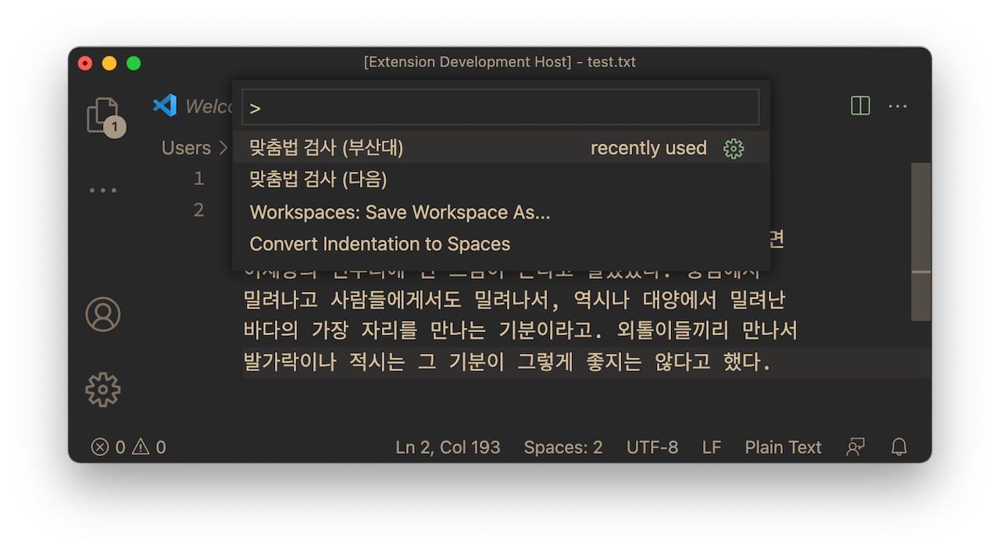
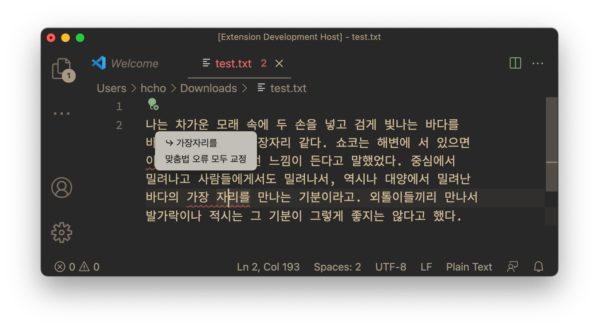
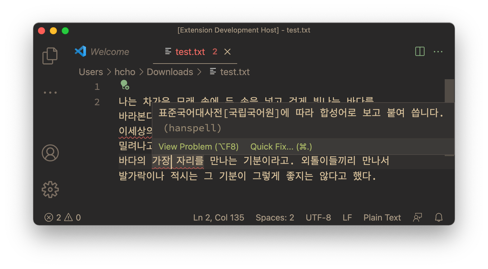

# 비주얼 스튜디오 코드 한스펠 vscode-hanspell

<i>비주얼 스튜디오 코드 한스펠vscode-hanspell</i>은, (주)다음과 부산대학교 인공지능연구실/(주)나라인포테크의 웹 서비스를 이용해서 한글 맞춤법 검사 기능을 제공하는 [비주얼 스튜디오 코드](https://code.visualstudio.com)용 [익스텐션](https://code.visualstudio.com/docs/editor/extension-marketplace)입니다.

터미널에서 커맨드 라인으로 작업하기를 선호하는 사람에게는 [hanspell](https://github.com/9beach/hanspell) 또는 [hanspell-hs](https://github.com/9beach/hanspell-hs)를 추천합니다.

## 주요 기능 및 사용법

F1 키를 눌러 명령 팔레트가 뜨면 아래의 그림과 같이 맞춤법 검사 명령을 선택할 수 있습니다. 만약 맞춤법 명령이 보이지 않는다면 '맞춤법'을 타이핑해서 검색하시기 바랍니다.

만약 문서의 특정 부분이 명시적으로 선택되었다면 그 부분만 검사하니 주의하세요.

맞춤법 검사를 마치면 오류가 의심되는 글자에 붉은 밑줄이 생깁니다. 커서를 해당 글자로 옮기면 왼쪽에 녹색 전구가 생기고 이것을 마우스로 클릭하면 아래의 그림과 같이 추천 단어와 `맞춤법 오류 모두 교정` 메뉴가 나타납니다.

부산대 서비스로 맞춤법 검사를 했을 때, 붉은 밑줄 위로 클릭하지 않고 마우스를 옮기면 아래의 그림과 같이 설명 창이 나타납니다. 맞춤법 오류의 근거를 자세히 설명해 준다는 점은 부산대 서비스의 장점 중 하나입니다. 부산대와 (주)다음의 서비스는 장단이 있으니 각자 비교해 보시기 바랍니다.

## 알려진 문제점

버그와 개선점은 [이슈 트래커](https://github.com/9beach/vscode-hanspell/issues)에 올려주세요.

**1. `맞춤법 오류 모두 교정` 커맨드 오류**

부산대 맞춤법 서비스의 결과는 간혹 범위가 중복되는 경우가 있습니다. 예컨대 "채마밭"이라는 단어의 맞춤법을 검사하면, "채마"는 "채소"로, "채마밭"은 "채소밭"으로 교정하기를 권합니다. "채마"라는 단어는 두 가지 교정 제안에 걸쳐 있는 셈입니다. 이때 `맞춤법 오류 모두 교정` 커맨드를 수행하면 교정에 실패합니다. 한 단어씩 교정하면 제대로 작동합니다.

**2. `$HOME/.hanspell-ignore` 적용 시기**

`$HOME/.hanspell-ignore` 파일에 단어를 추가하면 바로 반영되지 않습니다. 익스텐션을 재구동해야 합니다.

## 릴리스 노트

### 0.1.0

* (주)다음의 웹 서비스를 이용한 한글 맞춤법 검사 기능
* 부산대학교 인공지능연구실/(주)나라인포테크의 웹 서비스를 이용한 한글 맞춤법 검사 기능
* 단어별로 맞춤법을 교정하는 기능
* 한꺼번에 모든 맞춤법을 교정하는 기능
* 올바른 맞춤법으로 간주할 단어를 `$HOME/.hanspell-ignore` 파일에 저장하여 맞춤법 검사를 회피하는 기능
