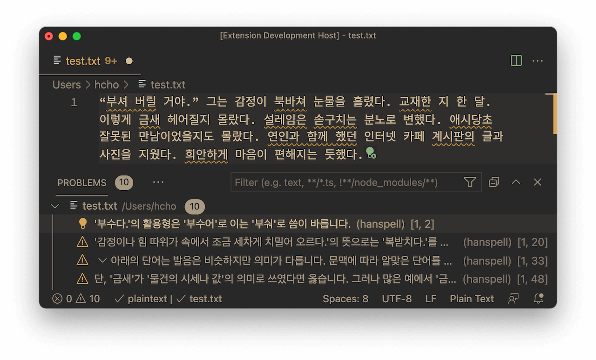

# 비주얼 스튜디오 코드 한스펠 <sup>vscode-hanspell</sup>

<i>비주얼 스튜디오 코드 한스펠<sup>vscode-hanspell</sup></i>은, (주)다음과 부산대학교 인공지능연구실/(주)나라인포테크의 웹 서비스를 이용해서 한글 맞춤법 검사 기능을 제공하는 [비주얼 스튜디오 코드](https://code.visualstudio.com)용 [익스텐션](https://code.visualstudio.com/docs/editor/extension-marketplace)입니다.

터미널과 커맨드 라인을 선호하는 분에게는 [hanspell](https://github.com/9beach/hanspell) 또는 [hanspell-hs](https://github.com/9beach/hanspell-hs)를 추천합니다.

## 설치

[비주얼 스튜디오 코드 마켓 플레이스](https://marketplace.visualstudio.com/items?itemName=9beach.vscode-hanspell) 또는 비주얼 스튜디오 코드 익스텐션 탭에서 '한스펠'로 검색해서 설치합니다.

## 주요 기능 및 사용법

### 맞춤법 검사

F1 키를 눌러 명령 팔레트가 뜨면 아래와 같이 맞춤법 검사 명령을 선택할 수 있습니다.

명령 팔레트의 오른쪽 톱니바퀴 아이콘을 클릭해서 핫키를 지정할 수 있습니다.

문서의 특정 영역을 마우스로 드래그해서 선택했다면 해당 영역만 검사하니 주의하세요.


### 맞춤법 교정

맞춤법 검사를 마치면 오류가 의심되는 글자에 붉은 밑줄이 생깁니다. 커서를 해당 글자로 옮기면 왼쪽에 녹색 전구가 생기고 이것을 마우스로 클릭하면 아래와 같이 추천 단어와 `맞춤법 오류 모두 교정` 메뉴가 나타납니다.


### 맞춤법 오류 정보

마우스를 붉은 밑줄 위로 클릭하지 않고 옮기면 아래와 같이 설명 창이 나타납니다. 맞춤법 오류의 근거를 자세히 설명한다는 점은 부산대 서비스의 장점입니다. 부산대와 (주)다음의 서비스는 장단이 있으니 각자 비교해 보기 바랍니다.


아래와 같이 분석 결과창(Ctrl+Shift+M)을 통해 한눈에 결과를 볼 수도 있습니다.



부산대 서비스는 접속 장애가 잦으니 참고하세요.

### 맞춤법 검사 제외 단어 지정

만약 러시아의 작가 톨스토이를 톨스또이로 쓰고 맞춤법 검사를 피하려면 홈 디렉터리에 `.hanspell-ignore` 파일을 만들고 '톨스또이*'를 등록하세요.

```
톨스또이*
이딸리아를
똘레랑스
```
위와 같이 등록하면 맞춤법 오류 중 '톨스또이', '톨스토이가' 등 '톨스또이'로 시작하는 오류는 제외하고 표시합니다. 반면 '이딸리아를'과 '똘레랑스'는 제외하지만 '이딸리아에서'와 '똘레랑스를' 등은 오류로 표시합니다.

아래의 예는 마크다운 문법과 URL, 영어 등을 맞춤법 검사에서 제외하는 데 유용합니다.

```
![*
*<*>*
.[[]*
.[a-zA-Z][a-zA-Z]*
*[a-zA-Z<>.]*[a-zA-Z<>.]*
*[a-zA-Z<>.]*/*[a-zA-Z<>.]*
*[a-zA-Z<>.]*/*[a-zA-Z<>.]*/*[a-zA-Z<>.]*
*[a-zA-Z<>.]*/*[a-zA-Z<>.]*/*[a-zA-Z<>.]*/*[a-zA-Z<>.]*
```

## 알려진 문제점

버그와 개선점은 [이슈 트래커](https://github.com/9beach/vscode-hanspell/issues)에 올려주세요.

**중복된 맞춤법 오류에 의한 `맞춤법 오류 모두 교정` 커맨드 실패**

부산대 맞춤법 서비스는 결과가 중복되는 경우가 있습니다. 예컨대 '채마밭'을 검사하면, '채마'는 '채소'로, '채마밭'은 '채소밭'으로 교정하도록 권합니다. 즉 '채마'라는 단어가 두 가지 교정 제안에 걸쳐 있습니다. 이런 상황이 더 복잡하게 얽히면 `맞춤법 오류 모두 교정` 커맨드가 실패할 수 있습니다. 한 단어씩 교정하면 제대로 작동합니다.
