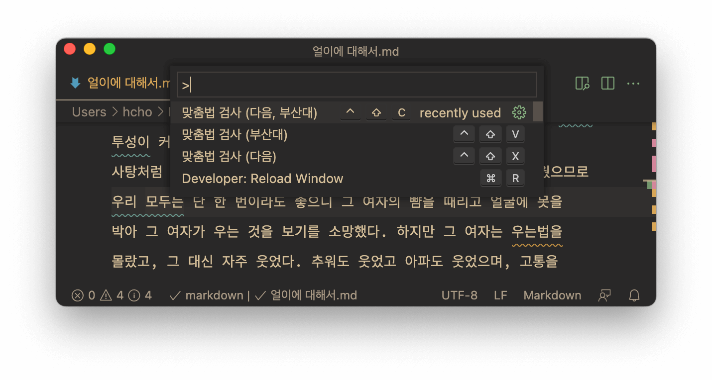
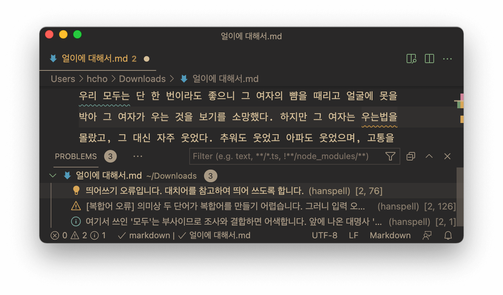

# 비주얼 스튜디오 코드 한스펠 <sup>vscode-hanspell</sup>

<i>비주얼 스튜디오 코드 한스펠<sup>vscode-hanspell</sup></i>은, (주)다음과 부산대학교 인공지능연구실/(주)나라인포테크의 웹 서비스를 이용해서 한글 맞춤법 검사 기능을 제공하는 [비주얼 스튜디오 코드](https://code.visualstudio.com)용 [익스텐션](https://code.visualstudio.com/docs/editor/extension-marketplace)입니다.

터미널과 커맨드 라인 팬에게는 [hanspell](https://github.com/9beach/hanspell)을 추천합니다.

## 설치

[비주얼 스튜디오 코드 마켓 플레이스](https://marketplace.visualstudio.com/items?itemName=9beach.vscode-hanspell) 또는 비주얼 스튜디오 코드 익스텐션 탭에서 '한스펠'로 검색해서 설치합니다.

## 주요 기능 및 사용법

### 맞춤법 검사

아래의 그림과 같이 명령 팔레트(`⇧⌘P`, `F1`)에서 맞춤법 검사를 실행할 수 있습니다.

명령 팔레트의 오른쪽 톱니바퀴 아이콘을 클릭해서 핫키를 지정할 수 있으니 꼭 지정하세요.

문서의 특정 영역을 마우스로 드래그해서 선택했다면 해당 영역만 검사합니다. 원하는 부분만 검사할 수 있어 유용합니다.



### 맞춤법 교정

맞춤법 검사를 마치면 오류가 의심되는 문자열에 붉은 밑줄이 생깁니다. 해당 문자열을 클릭하거나 커서를 옮기면 왼쪽에 녹색 전구가 생기고, 이것을 클릭하면 아래와 같이 추천 단어와 `맞춤법 오류 모두 교정` 메뉴가 뜹니다. 이 메뉴로 맞춤법을 교정합니다.


### 맞춤법 오류 정보

마우스를 붉은 밑줄 위로 옮기면 맞춤법 오류를 설명하는 작은 창이 뜹니다. 아래와 같이 분석 결과창(`⇧⌘M`)에서 한눈에 볼 수도 있습니다. (주)다음의 서비스에 비해 맞춤법 오류의 근거를 자세히 설명한다는 점은 부산대 서비스의 장점입니다만, 접속 장애가 잦다는 단점도 있습니다.



### 맞춤법 검사 제외 단어 지정

만약 러시아의 작가 톨스토이를 톨스또이로 쓰고 맞춤법 검사를 피하려면 홈 디렉터리에 `.hanspell-ignore` 파일을 만들고 '톨스또이*'를 등록하세요.

```
톨스또이*
이딸리아
```
위와 같이 등록하면 맞춤법 오류 중 '톨스또이', '톨스토이가' 등 '톨스또이'로 시작하는 오류는 제외하고 표시합니다. 반면 '이딸리아'는 제외하지만 '이딸리아에서'는 오류로 표시합니다.

 `.hanspell-ignore`는 [글로브 패턴](https://ko.wikipedia.org/wiki/글로브_(프로그래밍))을 지원합니다. 아래의 예는 마크다운 문법과 URL, 영어 등을 맞춤법 검사에서 제외하고 싶을 때 유용합니다.
```
![*
*<*>*
.[[]*
.[a-zA-Z][a-zA-Z]*
*[a-zA-Z<>.]*[a-zA-Z<>.]*
*[a-zA-Z<>.]*/*[a-zA-Z<>.]*
*[a-zA-Z<>.]*/*[a-zA-Z<>.]*/*[a-zA-Z<>.]*
*[a-zA-Z<>.]*/*[a-zA-Z<>.]*/*[a-zA-Z<>.]*/*[a-zA-Z<>.]*
```

## 알려진 문제점

버그와 개선점은 [이슈 트래커](https://github.com/9beach/vscode-hanspell/issues)에 올려주세요.

### 중복된 맞춤법 오류에 의한 `맞춤법 오류 모두 교정` 커맨드 실패

부산대 맞춤법 서비스는 결과가 중복되는 경우가 있습니다. 예컨대 '채마밭'을 검사하면, '채마'는 '채소'로, '채마밭'은 '채소밭'으로 교정하도록 권합니다. 즉 '채마'라는 단어가 두 가지 교정 제안에 걸쳐 있습니다. 이런 상황이 더 복잡하게 얽히면 `맞춤법 오류 모두 교정` 커맨드가 실패할 수 있습니다. 한 단어씩 교정하면 제대로 작동합니다.
